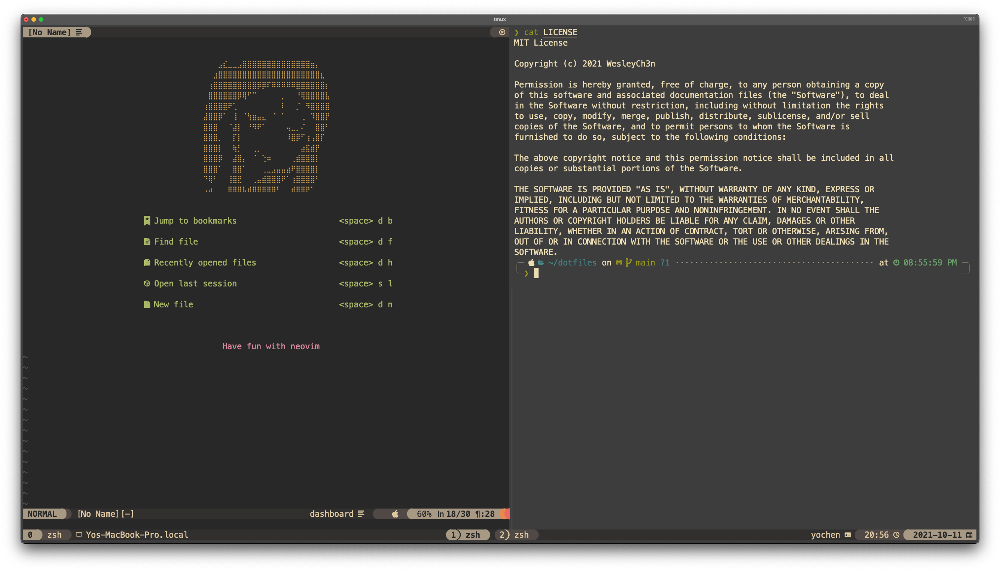
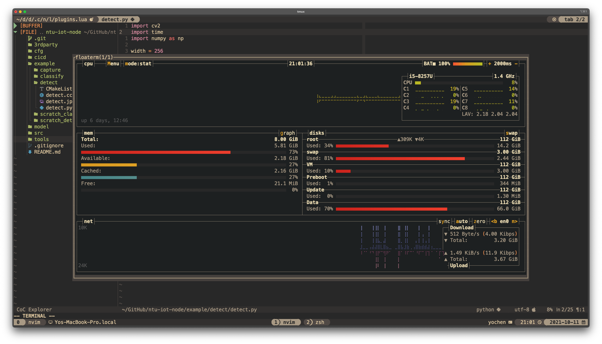
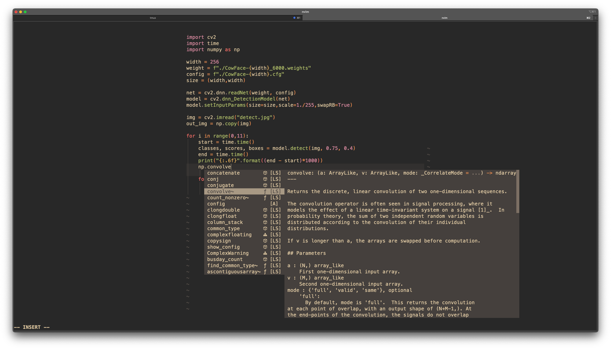
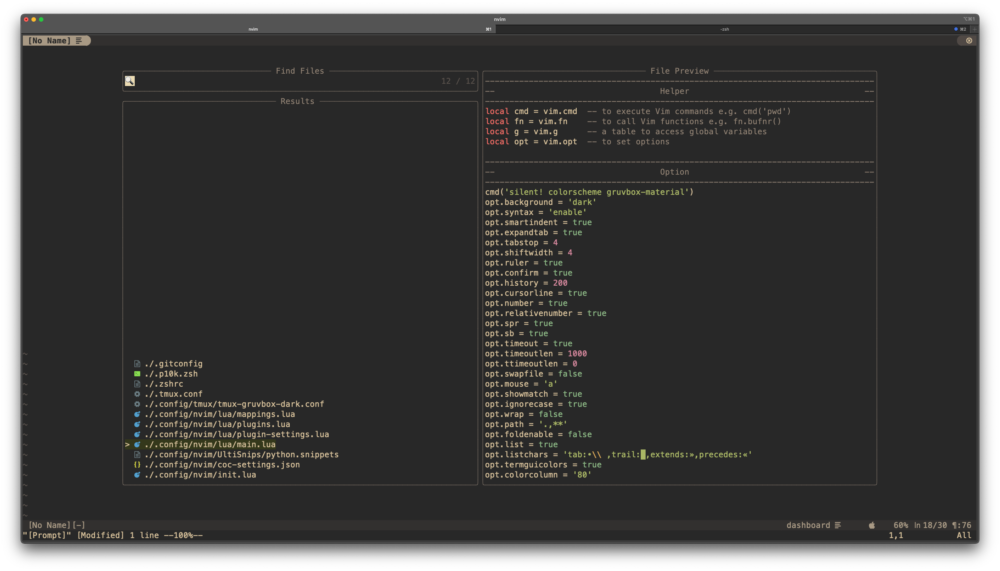

# dotfiles

WesleyCh3n's personal (minimal) dotfiles for MacOS/Ubuntu/Manjaro. If you see something
useful feel free to use.

dotfiles include:
- zsh
- tmux
- neovim
- ...(May grow up in future)

## Setup

### Install prerequisites

In `setup` directory
- `xx_install.sh`: install basic required package by your distro.
- `xx_manual.sh`: install 3rd-party package.
- `xx_install_nvim.sh`: install `neovim`.

### Link dotfiles

Use GNU `stow` to create soft-link.

Simply type:
```bash
make
```

## Screenshot

I lov Guvbox <3
|||
|:-:|:-:|
|||
|||
