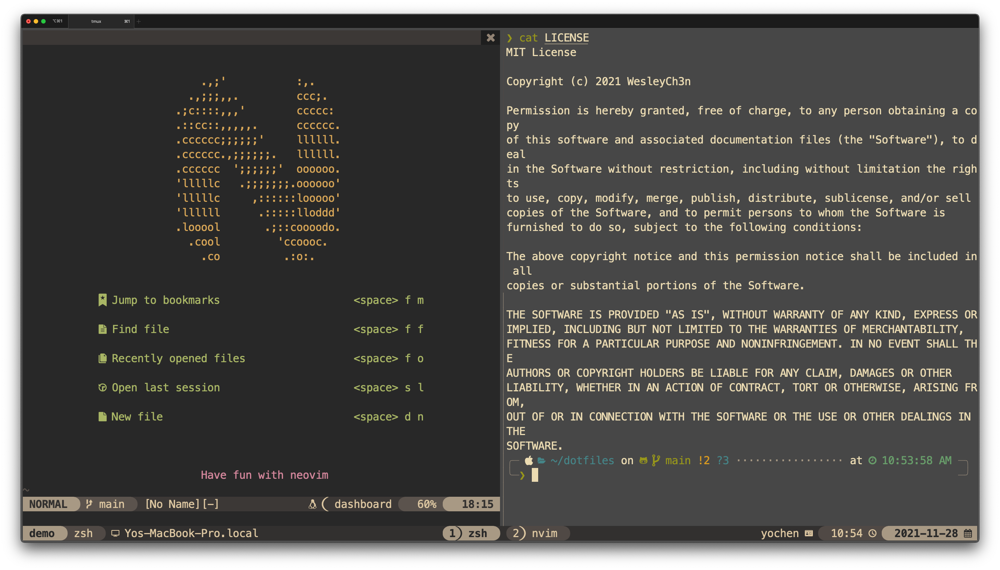
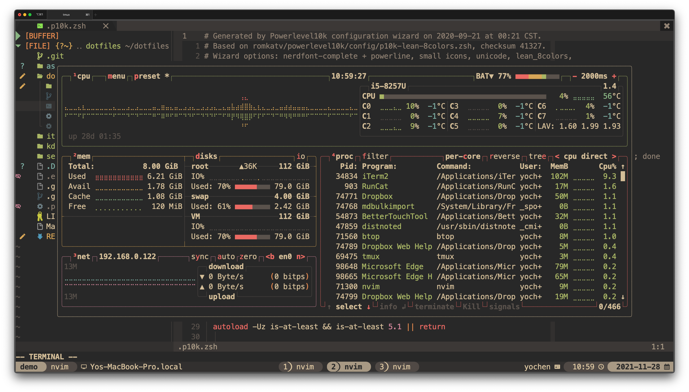
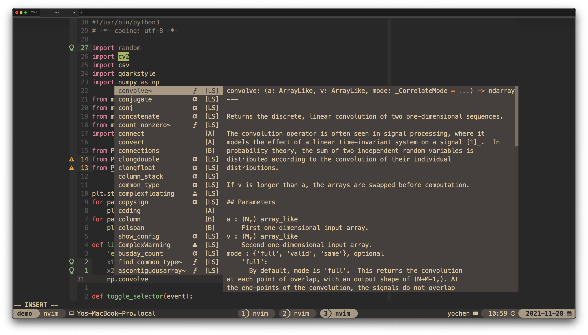
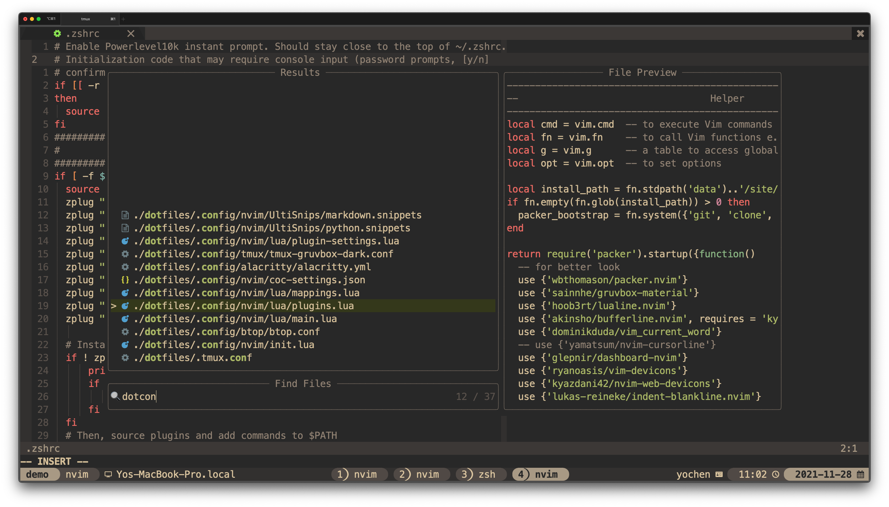

# WesleyCh3n's dotfiles

WesleyCh3n's personal (minimal) dotfiles for MacOS/Ubuntu/Manjaro. If you see something
useful feel free to use. Use as your own risk!

## 📖 Contents:
- neovim config
- tmux config
- zsh config
- terminal config: alacritty, iTerm2
- ...(some setup script)

## 🌟 Neovim setup

Required Neovim >= 0.6

Nerd Font: [MesloLGS NF](https://github.com/romkatv/powerlevel10k-media)

#### 🖥  Better Coding
-   [Packer.nvim](https://github.com/wbthomason/packer.nvim): A neovim plugin manager
-   [nvim-lspconfig](https://github.com/neovim/nvim-lspconfig)
-   [nvim-treesitter](https://github.com/nvim-treesitter/nvim-treesitter)
-   [nvim-cmp](https://github.com/hrsh7th/nvim-cmp)

#### 🚀 Better Control
-   [telescope.nvim](https://github.com/nvim-telescope/telescope.nvim)
-   [nvim-tree.lua](https://github.com/kyazdani42/nvim-tree.lua): A neovim file explorer
-   [hop.nvim](https://github.com/phaazon/hop.nvim)
-   [surround.vim](https://github.com/tpope/vim-surround)
-   [auto-pairs](https://github.com/jiangmiao/auto-pairs)
-   [nerdcommenter](https://github.com/preservim/nerdcommenter)
-   [vim-easy-align](https://github.com/junegunn/vim-easy-align)
-   [targets.vim](https://github.com/wellle/targets.vim)
-   [vim-tmux-navigator](https://github.com/christoomey/vim-tmux-navigator)
-   [vim-visual-multi](https://github.com/mg979/vim-visual-multi)
-   [better-escape.nvim](https://github.com/max397574/better-escape.nvim)
-   [undotree](https://github.com/mbbill/undotree)

#### ✨ Better UI
-   [gruvbox-material](https://github.com/sainnhe/gruvbox-material)
-   [galaxyline.nvim](https://github.com/glepnir/galaxyline.nvim)
-   [bufferline.nvim](https://github.com/akinsho/bufferline.nvim)
-   [which-key.nvim](https://github.com/folke/which-key.nvim)
-   [wilder.nvim](https://github.com/gelguy/wilder.nvim)
-   [registers.nvim](https://github.com/tversteeg/registers.nvim)
-   [indent-blankline.nvim](https://github.com/lukas-reineke/indent-blankline.nvim)
-   [gitsigns.nvim](https://github.com/lewis6991/gitsigns.nvim)
-   [todo-comments.nvim](https://github.com/folke/todo-comments.nvim)
-   [vim-illuminate](https://github.com/RRethy/vim-illuminate)
-   [zen-mode.nvim](https://github.com/folke/zen-mode.nvim)

## 💻 Shell setup
-   [zsh](https://github.com/zsh-users/zsh)
-   [zgen](https://github.com/tarjoilija/zgen)
-   [powerlevel10k](https://github.com/romkatv/powerlevel10k)
-   [lazygit](https://github.com/jesseduffield/lazygit)
-   [fd](https://github.com/sharkdp/fd)
-   [ripgrep](https://github.com/BurntSushi/ripgrep)
-   [fzf](https://github.com/junegunn/fzf)
-   [fzf-tab](https://github.com/Aloxaf/fzf-tab)
-   [nnn](https://github.com/jarun/nnn)
-   [btop](https://github.com/aristocratos/btop)
-   [macchina](https://github.com/Macchina-CLI/macchina)

## 📦 Setup Scripts

### Install prerequisites

In `setup` folder, run script in following order
- `install_essential.*.sh`: Install basic requirements by your fav package manager.
- `install_package_manager`: install zsh/tmux package manager
- `install_package`: install 3rd-party binary.
  - Usage:
  ```bash
  # if you use linux
  install_package.sh package.linux-x86_64.sh
  # if you use macos
  install_package.sh package.macos-x86_64.sh
  ```
  > ⚠️⚠️⚠️ you can read through `package.*-x86_64.sh` to see what will be installed. It's fine to comment out what you don't need.
- `install_nvim`: install Neovim
  - Usage:
  ```bash
  # if you use linux
  install_nvim.sh package.linux-x86_64.sh
  # if you use macos
  install_nvim.sh package.macos-x86_64.sh
  ```
- `pacakge_manual.*-x86_64.sh`: install package requiring compile your own.

### Link dotfiles

Use GNU `stow` to create soft-link.

Simply type:
```bash
make
```

and good to go~

<!-- ## Screenshot -->

<!-- I lov Gruvbox <3 -->
<!-- <details> -->
  <!-- <summary>Image preview</summary> -->

<!-- ||| -->
<!-- |:-:|:-:| -->
<!-- ||| -->

<!-- </details> -->
